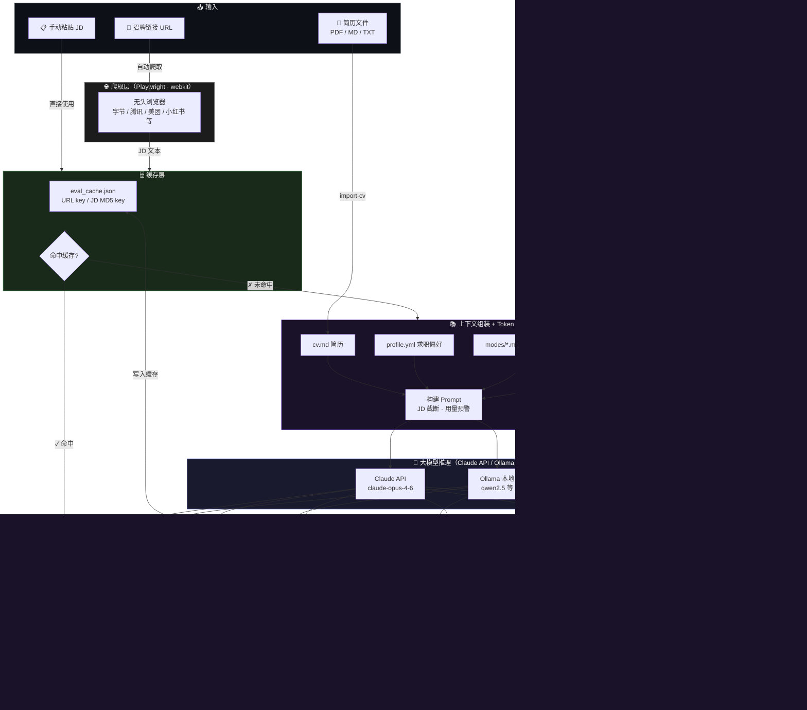

# Career-Ops 🚀

**AI 驱动的实习求职自动化系统** — 输入招聘链接，自动爬取 JD、AI 评分、生成 PDF 报告、可视化追踪申请进度，并在面试前自动准备好 STAR 故事素材。

> 受 [santifer/career-ops](https://github.com/santifer/career-ops) 启发，专为中国互联网实习求职场景定制。

---

## ✨ 功能

| 功能 | 说明 |
|------|------|
| 🔍 **AI 职位评估** | 输入招聘链接或 JD，Claude / Ollama 自动 7 维度打分（A–F 等级） |
| 🌐 **自动爬取 JD** | Playwright 自动抓取字节、腾讯、美团、小红书等主流平台 |
| 📄 **PDF 报告生成** | 每次评估自动生成带维度进度条的中文 PDF |
| 📊 **可视化看板** | 深色主题 HTML 看板，支持筛选、搜索、状态追踪 |
| 🎯 **AI 职位推荐** | 输入求职方向，AI 推荐 10–15 个匹配公司和职位 |
| ✂️ **定向简历裁剪** | 针对每个 JD 自动重排经历、对齐关键词，生成定制版简历 |
| 💌 **求职信生成** | 基于简历和 JD 一键生成专业中文求职信，引用真实数据 |
| ⭐ **STAR 故事库** | 评估 JD 时自动生成面试故事，随时间积累成个人素材库 |
| 🗄️ **评估结果缓存** | 相同 JD 直接命中缓存，跳过 LLM 调用，节省 100% API 费用 |
| 🧪 **A/B 测试** | 量化验证 Token 优化方案（摘要 CV vs 全文 CV）的质量代价 |
| ⚡ **Token 优化** | CV 自动压缩摘要（节省 69% tokens）+ JD 超长截断 + 用量预警 |
| 📥 **简历导入** | 直接导入 PDF / TXT / MD 格式简历 |

---

## 🗺 技术流图



---

## 🚀 快速开始

### 1. 克隆项目

```bash
git clone https://github.com/yhdd-ai/career-ops.git
cd career-ops
```

### 2. 安装依赖

```bash
pip install -r requirements.txt
playwright install webkit
```

### 3. 导入简历

```bash
python3 run.py import-cv ~/Downloads/你的简历.pdf
```

### 4. 配置个人偏好

编辑 `config/profile.yml`，设置目标岗位、城市、薪资期望等（约 2 分钟）。

### 5. 生成 CV 摘要缓存

```bash
python3 run.py gen-cv-summary
```

> 首次必做，之后只在更新简历后重新执行。每次评估可节省约 325 tokens（69%）。

### 6. 开始使用！

```bash
# 全自动评估 + 面试故事一步到位
python3 run.py evaluate --url "https://jobs.bytedance.com/..." --star
```

---

## 🔑 API 配置

### Claude API（推荐）

编辑 `config/api.yml`：

```yaml
anthropic_api_key: "sk-ant-你的key"
model: "claude-opus-4-6"
```

### Ollama 本地模型（免费）

```bash
ollama serve
ollama pull qwen2.5:7b
```

编辑 `config/api_local.yml`，使用时加 `--backend ollama`。

### 后端自动切换

```bash
python3 run.py [--backend auto|claude|ollama] <命令>
```

| `--backend` | 行为 |
|-------------|------|
| `auto`（默认）| 有 API Key 用 Claude，否则自动降级 Ollama |
| `claude` | 强制 Claude API |
| `ollama` | 强制本地 Ollama |

---

## 📖 命令手册

### 核心评估

```bash
# 链接评估（自动爬取 JD）
python3 run.py evaluate --url "招聘链接"

# 评估 + 同步生成 STAR 面试故事
python3 run.py evaluate --url "招聘链接" --star

# 强制重新评估（忽略缓存）
python3 run.py evaluate --url "招聘链接" --no-cache

# 手动输入 JD
python3 run.py evaluate --jd "JD文本" --company "字节" --title "后端实习"

# 本地模型评估
python3 run.py --backend ollama evaluate --url "招聘链接"
```

### 简历与求职信

```bash
# 导入简历
python3 run.py import-cv ~/Downloads/resume.pdf

# 按 JD 定向裁剪简历
python3 run.py tailor-cv --url "招聘链接"
python3 run.py tailor-cv --jd-file jd.txt --company "字节" --title "大模型算法实习"

# 生成求职信
python3 run.py cover-letter --url "招聘链接"
python3 run.py cover-letter --jd "JD文本" --company "字节" --title "大模型算法实习"
```

### STAR 故事库

```bash
# 查看故事库列表
python3 run.py stories list

# 按关键词搜索（面试前快速找素材）
python3 run.py stories search --keyword "大模型"
python3 run.py stories search --keyword "字节"

# 单独为某个 JD 生成 STAR 故事
python3 run.py stories gen --jd-file jd.txt --company "腾讯" --title "算法实习"
```

### 评估缓存

```bash
# 查看缓存统计
python3 run.py cache stats

# 删除单条缓存（强制重新评估某职位）
python3 run.py cache remove --url "招聘链接"

# 清空所有缓存
python3 run.py cache clear
```

### A/B 测试

```bash
# 对比摘要 CV vs 全文 CV 的评分差异（默认 3 轮）
python3 run.py ab-test --jd-file jd.txt --company "字节" --title "算法实习"

# 增加轮次以提高统计置信度
python3 run.py ab-test --url "招聘链接" --rounds 5
```

### AI 推荐 & 进度管理

```bash
# AI 推荐匹配职位
python3 run.py recommend --direction "大模型算法"

# 查看 / 更新申请进度
python3 run.py list
python3 run.py update <ID> 已申请
python3 run.py stats

# 生成 PDF / 打开看板
python3 run.py pdf <ID>
python3 run.py dashboard
```

### 申请状态流转

`待申请` → `已申请` → `笔试/测评` → `面试中` → `已拿Offer` / `已拒绝` / `已放弃`

---

## 📊 评分体系

| 维度 | 权重 | 说明 |
|------|------|------|
| 岗位匹配度 | 25% | 技能与 JD 要求的契合程度 |
| 成长空间 | 20% | 学习机会与职业发展潜力 |
| 公司质量 | 15% | 品牌、规模与行业地位 |
| 地点匹配 | 10% | 与偏好城市的匹配程度 |
| 薪资水平 | 10% | 与期望薪资的对比 |
| 经验要求匹配 | 10% | 门槛是否适合实习生 |
| 工作强度与文化 | 10% | 工作环境与节奏 |

**等级：** A（85+）强烈推荐 · B（70–84）推荐 · C（55–69）可尝试 · D（40–54）不推荐 · F（<40）跳过

---

## ⚙️ 工程设计亮点

### LLM 接口抽象层
`src/llm_client.py` 用 Python ABC 定义统一的 `LLMClient` 接口，`ClaudeClient` 和 `OllamaClient` 分别实现。工厂函数 `get_client(backend)` 支持 auto / claude / ollama 三种模式，上层业务代码不感知底层模型，新增模型只需实现接口类。

### Token 成本控制
- **CV 摘要压缩**：规则提取教育、经历、技能关键信息，压缩率 69%，零 LLM 消耗，MD5 hash 做失效检测
- **JD 截断**：超过 1500 字时在句子边界截断，保留核心段落
- **分场景策略**：evaluate / recommend 用摘要 CV；tailor-cv / cover-letter / star-story 用完整 CV

### 评估结果缓存
`src/cache.py` 实现两级 Key 策略：有 URL 时以规范化 URL（去 UTM 参数）为 key，手动粘贴 JD 时以 MD5 hash 为 key。命中时完全跳过 LLM 调用，`hit_count` 记录复用次数。

### A/B 实验框架
`src/ab_test.py` 对同一 JD 分别运行基准版（全文 CV + 完整 JD）和优化版（摘要 CV + 截断 JD），每个 Variant 重复 N 轮取均值，输出评分偏差、token 节省率、响应加速比。实测：评分偏差 ≤3 分，token 节省 27%。

### STAR 故事库
`src/star_bank.py` 在每次评估后可选触发 STAR 故事生成（`--star`），从完整简历中挑选最相关经历，格式化为 Situation-Task-Action-Result 结构并追加到 `story_bank.md`，支持按关键词搜索。

---

## 📁 项目结构

```
career-ops/
├── run.py                  # 统一入口（--backend auto|claude|ollama）
├── requirements.txt
├── cv.md                   # 你的简历（import-cv 自动写入）
├── config/
│   ├── api.yml             # Claude API Key & 模型
│   ├── api_local.yml       # Ollama 配置
│   ├── profile.yml         # 求职偏好（城市、岗位、薪资）
│   └── cv_summary.md       # CV 压缩摘要缓存（自动生成）
├── modes/                  # Prompt 模板
│   ├── evaluate.md         # 7 维度评估规则
│   ├── recommend.md        # 职位推荐规则
│   ├── tailor_cv.md        # 简历裁剪规则
│   ├── cover_letter.md     # 求职信写作规则
│   └── star_story.md       # STAR 故事生成规则
├── src/
│   ├── utils.py            # 公共工具（load_cv / load_mode / load_profile）
│   ├── llm_client.py       # LLM 统一接口（Claude / Ollama ABC 抽象层）
│   ├── evaluator.py        # 评估引擎
│   ├── recommender.py      # 推荐模块
│   ├── cv_tailor.py        # 简历定向裁剪
│   ├── cover_letter.py     # 求职信生成
│   ├── star_bank.py        # STAR 故事库（生成 + 追加 + 搜索）
│   ├── cache.py            # 评估结果缓存（URL key / MD5 key）
│   ├── ab_test.py          # A/B 测试框架
│   ├── token_optimizer.py  # Token 优化（CV摘要 / JD截断 / 预警）
│   ├── scraper.py          # JD 爬虫（Playwright）
│   ├── tracker.py          # 职位追踪（SQLite-like JSON）
│   ├── pdf_gen.py          # PDF 报告生成
│   ├── dashboard_gen.py    # HTML 看板生成
│   └── cv_importer.py      # 简历导入（PDF/TXT/MD）
├── data/
│   ├── jobs.json           # 职位追踪数据
│   └── eval_cache.json     # 评估结果缓存
└── reports/
    ├── story_bank.md       # STAR 面试故事库（自动积累）
    ├── tailored_cvs/       # 定向裁剪版简历（MD）
    ├── cover_letters/      # 求职信（MD）
    ├── ab_tests/           # A/B 测试 JSON 报告
    └── *.pdf               # 评估报告 PDF
```

---

## 🌐 支持的招聘平台

字节跳动 · 腾讯 · 阿里巴巴 · 美团 · 京东 · 快手 · 百度 · 小红书 · 实习僧 · 牛客网，以及通用页面兜底解析。

---

## 🛠 常见问题

**Q：爬取失败 / 超时**
加 `--visible` 查看浏览器行为，或直接粘贴 JD：
```bash
python3 run.py evaluate --jd "职位描述内容" --company "公司" --title "职位"
```

**Q：相同职位被重复评估**
使用缓存（默认开启），相同 URL 自动命中。如需强制重新评估：
```bash
python3 run.py evaluate --url "链接" --no-cache
```

**Q：A/B 测试评分差异较大**
增加 `--rounds` 轮次（推荐 5 轮以上），减少 LLM 随机性对结果的影响。

**Q：STAR 故事与我的经历不匹配**
检查 `cv.md` 是否包含量化数据和具体行动描述，STAR 质量高度依赖简历的细节丰富程度。

**Q：PDF 中文显示方框**
在 `src/pdf_gen.py` 的 `CHINESE_FONT_PATHS` 列表中添加你系统的字体路径。

**Q：Ollama 模型响应慢**
在 `config/api_local.yml` 中增大 `timeout`，或换用更小的模型如 `qwen2.5:3b`。

**Q：API 费用太高**
确认已运行 `gen-cv-summary`，并查看缓存命中情况：
```bash
python3 run.py cache stats
```

**Q：`Client.__init__() got unexpected argument 'proxies'`**
```bash
pip install --upgrade anthropic
```

---

## 📌 Roadmap

- [x] AI 职位评估（7 维度 · A–F 等级）
- [x] Playwright 自动爬取主流平台
- [x] PDF 报告生成
- [x] 可视化看板
- [x] AI 职位推荐
- [x] 简历导入（PDF / TXT / MD）
- [x] Ollama 本地模型支持
- [x] LLM 统一接口抽象层（Claude / Ollama · ABC 模式 · 工厂函数）
- [x] 定向简历裁剪（按 JD 重排 + 关键词对齐）
- [x] 求职信一键生成
- [x] Token 优化（CV 摘要压缩 69% + JD 截断 + 用量预警）
- [x] 评估结果缓存（URL key / MD5 key · hit_count 追踪）
- [x] A/B 测试框架（量化 Token 优化质量代价）
- [x] STAR 面试故事库（自动生成 + 持久积累 + 关键词搜索）
- [ ] 批量 URL 并行评估（asyncio 并发）
- [ ] 岗位 Archetype 分类（两阶段 LLM pipeline）
- [ ] 门控维度评分（gate-pass 逻辑）
- [ ] 微信 / 钉钉投递结果通知

---

## License

MIT
